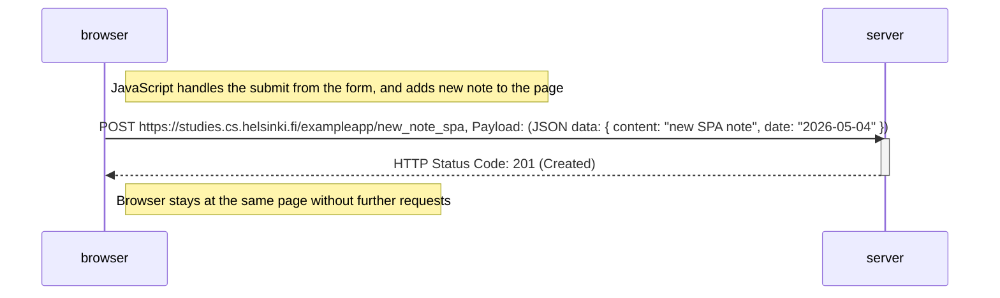

```mermaid
sequenceDiagram
    participant browser
    participant server

    Note right of browser: JavaScript handles the submit from the form, and adds new note to the page

    browser->>server: POST https://studies.cs.helsinki.fi/exampleapp/new_note_spa, Payload: (JSON data: { content: "new SPA note", date: "2026-05-04" })
    activate server
    server-->>browser: HTTP Status Code: 201 (Created)
    deactivate server
    
    Note right of browser: Browser stays at the same page without further requests
```
